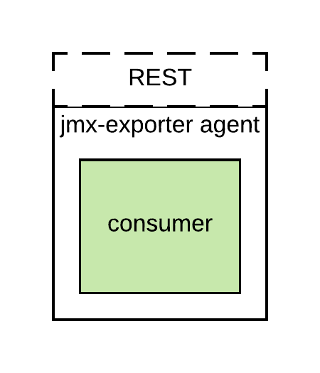
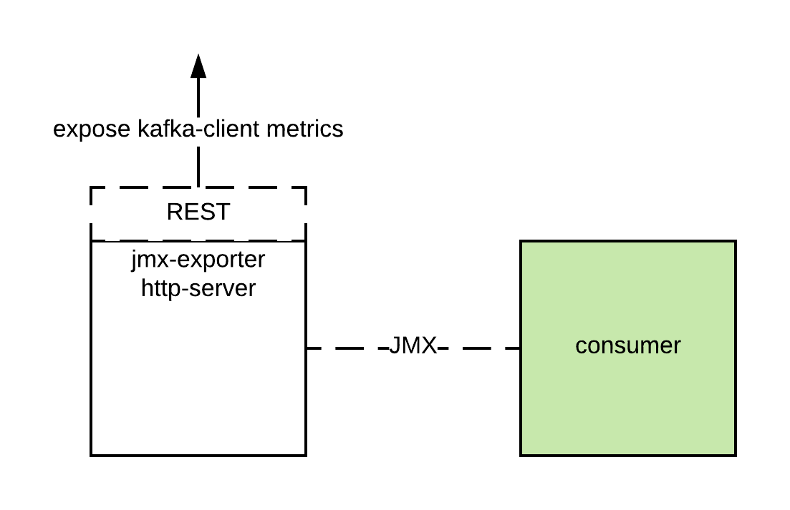
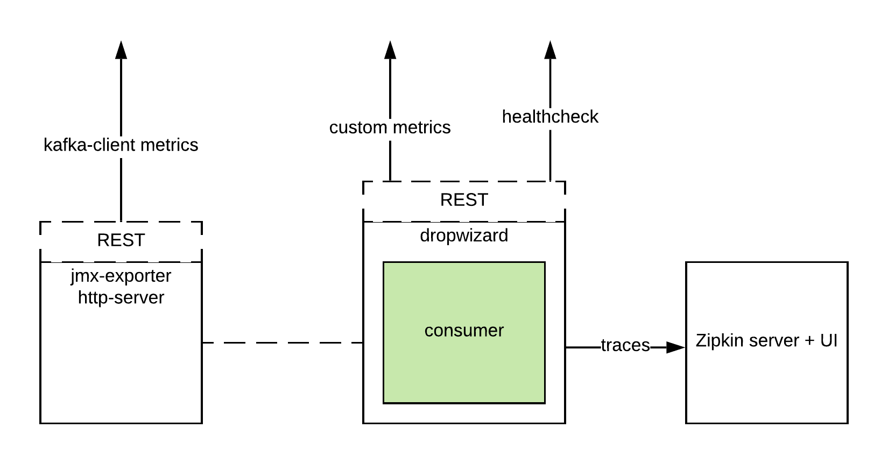

# Kafka-clients jmx metrics
Different modes how to expose metrics from Kafka-clients with Prometheus [jmx-exporter](https://github.com/prometheus/jmx_exporter).  

Also example of kafka-clients tracing with [Zipkin](https://zipkin.io/).

### How to run
* Build project `./mvnw clean install`
* Run kafka `docker-compose up -d`

### [Prometheus metrics with javaagent](./consumer-metrics/readme.md)

### [Prometheus metrics with decoupled http server](./producer-metrics/readme.md)

### [Custom prometheus metrics & tracing with zipkin](./streams-metrics/readme.md)

### References 
- [JMX from docker container](https://github.com/cstroe/java-jmx-in-docker-sample-app)
- Kafka related [Monitoring docker container jmx](https://docs.confluent.io/current/installation/docker/docs/operations/monitoring.html)
- [Kafka-clients metrics](https://docs.confluent.io/current/kafka/monitoring.html) to build patterns for jmx exporter agent
